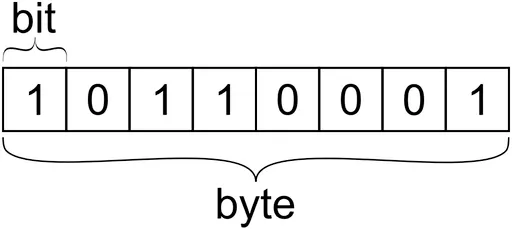

## 메모리와 데이터에 관한 배경지식
1. 메모리, 데이터
    - 비트
      - 컴퓨터가 이해할 수 있는 가장 작은 단위
      - 0과 1을 가지고 있는 메모리를 구성하기 위한 가장 작은 조각
      - 이 작은 조각들이 모여 '메모리'가 만들어짐
    - 바이트
      - 0과 1만 표현하는 비트를 모두 찾기에 부담되어 만들어짐
      - 1개 -> 2개 -> ... -> 8개(새로운 단위: byte)
      
    - 메모리 : byte 단위로 구성됨
      - 모든 데이터는 byte 단위의 식별자인 메모리 주소값을 통해서 서로 구분됨
    - java, c와 다른 javascript의 메모리 관리 방식
      - 8을 저장하는 방법
        - JS: let a = 8(8byte) // 일부 최적화되면 8byte에 무조건 저장하는 것은 아니다.
        - JAVA
          - byte a = 8(1byte)
          - short a = 8(2byte)
          - int a = 8(4byte)
          - long a = 8(16byte)
        - java 또는 c는 데이터의 크기에 따라 다양하게 지정해줘야했지만 javascript는 고민하지 않아도 된다.

## 기본형 데이터
```javascript
/** 선언과 할당을 풀어 쓴 방식 */
var str;
str = 'test!';

/** 선언과 할당을 붙여 쓴 방식 */
var str = 'test!';
```
**변수명**
|주소|1001|1002|1003|1004|1005|...|
|------|---|---|---|---|---|---|
|데이터|str/@5001|  |  |  |  |  |

**데이터(변수)**
|주소|5001|5002|5003|5004|5005|...|
|------|---|---|---|---|---|---|
|데이터|'test!'|  |  |  |  |  |

값을 바로 변수에 대입하지 않는 이유(=무조건 새로 만드는 이유)
- 자유로운 데이터 변환
  - 이미 입력한 무자열이 길어진다면, 침범하게되는 메모리 영역을 모두 오른쪽으로 다~~ 미뤄야 하기 때문에 이러한 시프트 연산은 매우 비효율적이고 성능이 느려짐
- 메모리의 효율적 관리
  - 똑같은 데이터를 여러번 저장해야 한다면?
  - 변수 영역과 데이터 영역을 나누어 저장하면 메모리는 아낄 수 있음
    - 바로 대입할 경우 1만개 * 8byte = 8만 byte
    - 변수 영역에 별도 저장
      - 변수 영역 : 2바이트 1만개 = 2만 바이트 (가정한 값)
      - 데이터 영역 : 8파이트 1개 = 8바이트
      - 총: 2만 8바이트

#### 불변값과 불변성
```javascript
// 'abc' 라는 값이 데이터 영역의 @5002라는 주소에 추가되었다고 가정
var a = 'abc';

// 'def' 라는 값이 @5002라는 주소에 추가되는 것이 아님
// @5003에 별도로 'abcdef'라는 값이 생기고
// a라는 변수는 @5002 -> @5003
// 즉 "변수 a는 불변한다." 라고 할 수 있음
// 이때, @5002는 더 이상 사용되지 않기 때문에 가비지컬렉터의 수거 대상이 됨
a = a + 'def';
```

## 참조형 데이터
### 참조형 데이터의 변수 할당 과정
```javascript
// 참조형 데이터는 별도 저장공간(obj1을 위한 별도 공간)이 필요함
var obj1 = {
  a: 1,
  b: 'bbb',
};
```
**변수명**
|주소|1001|1002|1003|1004|1005|...|
|------|---|---|---|---|---|---|
|데이터|obj1/@6001 ~ @6002|  |  |  |  |  |

**데이터(변수)**
|주소|5001|5002|5003|5004|5005|...|
|------|---|---|---|---|---|---|
|데이터|1|'bbb'|  |  |  |  |

**obj1**
|주소|6001|6002|6003|6004|6005|...|
|------|---|---|---|---|---|---|
|데이터|a/@5001|b/@5002|  |  |  |  |

---
### 참조형 데이터가 불변하지 않다(가변하다)라고 하는 이유
```javascript
// 참조형 데이터는 별도 저장공간(obj1을 위한 별도 공간)이 필요함
var obj1 = {
  a: 1,
  b: 'bbb',
};

// 데이터 변경
obj1.a = 2
```
**변수명**
|주소|1001|1002|1003|1004|1005|...|
|------|---|---|---|---|---|---|
|데이터|obj1/@6001 ~ @6002|  |  |  |  |  |

**데이터(변수)**
|주소|5001|5002|5003|5004|5005|...|
|------|---|---|---|---|---|---|
|데이터||'bbb'|2|  |  |  |

**obj1**
|주소|6001|6002|6003|6004|6005|...|
|------|---|---|---|---|---|---|
|데이터|a/@5003|b/@5002|  |  |  |  |

- @5003에 2를 추가함
- @6001에 @5003을 할당
- @5001은 GC의 제거 대상이됨
- 데이터 영역에 저장된 값은 여전히 불변함(가변하지 않고, 추가됨), 하지만 obj1을 위한 별도 영역은 변경이 가능함 -> 불변하지 않다(=가변한다)라고 함

### 중첩객체의 할당
```javascript
var obj1 = {
  x: 3,
  arr: [3, 4, 5],
};
```
**변수명**
|주소|1001|1002|1003|1004|1005|...|
|------|---|---|---|---|---|---|
|데이터|obj/@6001 ~ @6002|  |  |  |  |  |

**데이터(변수)**
|주소|5001|5002|5003|5004|5005|...|
|------|---|---|---|---|---|---|
|데이터|3|4|5|  |  |  |

**obj1 영역**
|주소|6001|6002|6003|6004|6005|...|
|------|---|---|---|---|---|---|
|데이터|x/@5001|arr/@7001 ~ @7002|  |  |  |  |

**arr 영역**
|주소|7001|7002|7003|7004|7005|...|
|------|---|---|---|---|---|---|
|데이터|0/@5001|1/@5002|2/@5003|  |  |  |