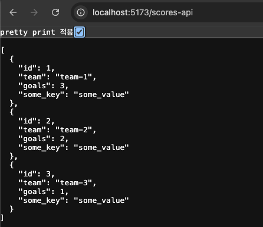

# TIL - 2024-09-05

## 주제 : 리소스 라우트

### 1. 개념 정의
- 데이터만 반환하고, 사용자에게 페이지를 렌더링하지 않는 특수한 라우트다.
  - 리소스 라우트는 주로 **API 엔드포인트**와 같은 역할을 한다. 이는 JSON 데이터, 파일, 이미지 등을 반환하거나 다른 요청에 대한 응답을 처리하는 데 사용된다.

### 2. 주요 사용 사례 예시

#### **예시 1**: `JSON` 형식을 반환하는 리소스 라우트

Remix에서 다음과 같은 구조의 파일이 있다고 가정해보자:

```bash
└── /scores-api.ts
```

이 구조는 다음과 같이 라우트를 표현한다.

1. `/scores-api.ts`: `/scores-api` 라우트를 처리 `loader` 함수의 반환값을 출력함.

<br/>

Remix 코드 예시:
```ts
// scores-api.ts

export async function loader() {
  const scores = [
    { id: 1, team: "team-1", goals: 3, some_key: "some_value" },
    { id: 2, team: "team-2", goals: 2, some_key: "some_value" },
    { id: 3, team: "team-3", goals: 1, some_key: "some_value" },
  ];

  return scores;
}
```

`/scores-api` 접속 예시:
<br/>



### 3. 주의할 점 / 참고할 점
- 데이터를 반환할 때, 매개변수를 사용하여 데이터를 반환할 수도 있음.
- 주로 **API 엔드포인트**로 사용되어 클라이언트와 서버 간의 데이터를 주고받는 역할을 한다고 함.
- `loader` 함수는 `GET` 요청을 처리하고, `action` 함수는 `POST`, `PUT`, `DELETE` 등 다른 메서드를 처리함.

### 4. 추가 참고 자료
- [Remix v2 Lecture](https://www.udemy.com/course/remix-js-course/?couponCode=OF83024D)